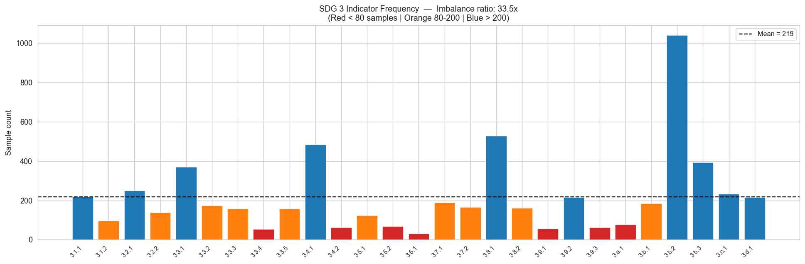
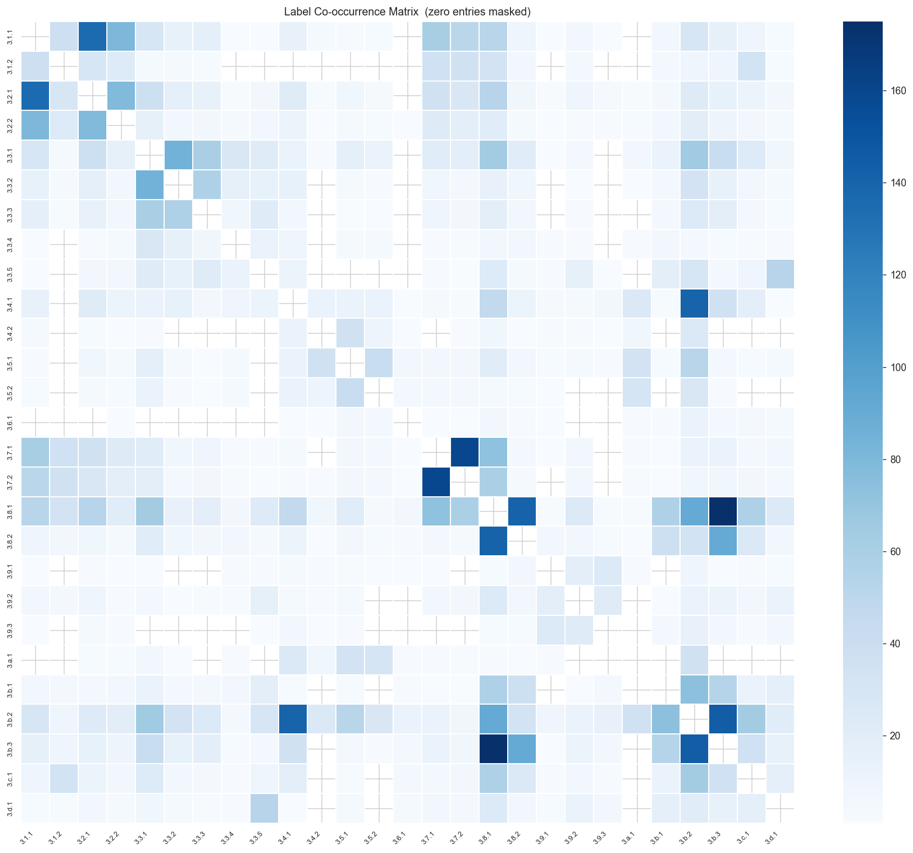
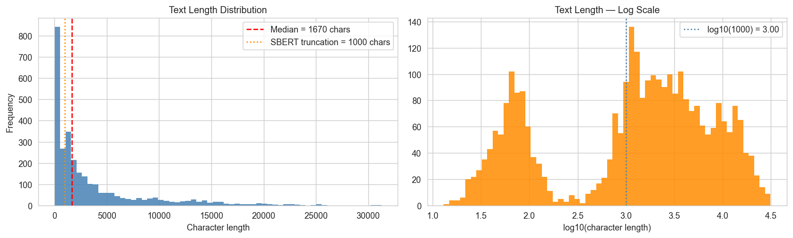
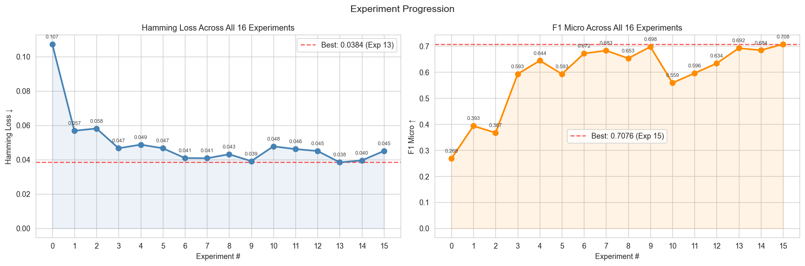
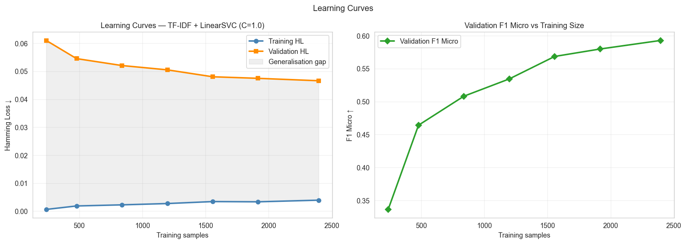
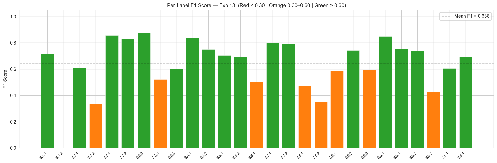
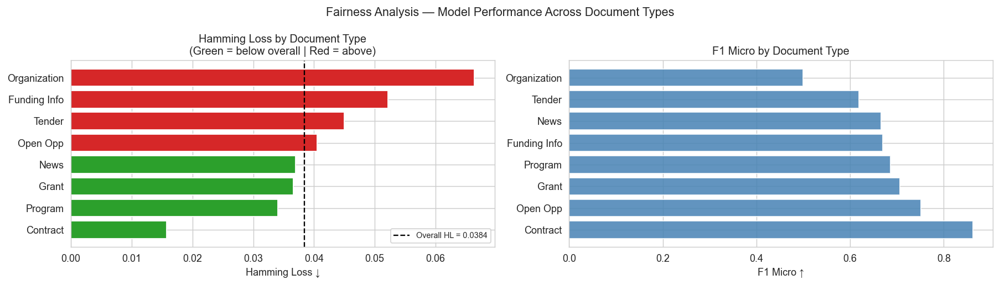
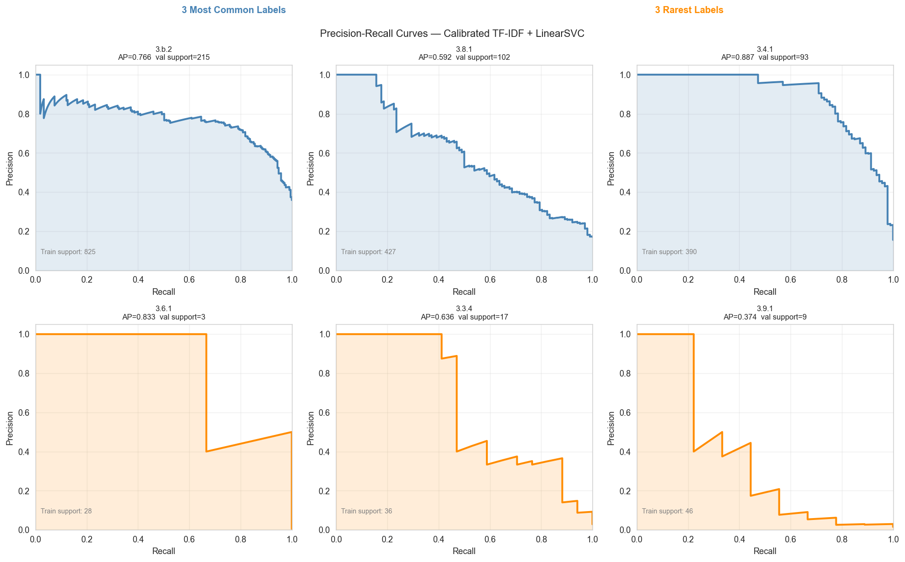

# SDG 3 Indicator Text Classification

> A systematic 16-experiment multi-label NLP study predicting which SDG 3 ("Good Health and Well-Being") indicators apply to international development documents, using TF-IDF, Sentence-BERT embeddings, and per-label threshold optimization.

**Best result:** Hamming Loss **0.0384** — a **64.2% improvement** over the naive baseline, achieved with L2-normalized TF-IDF + SBERT fusion under LinearSVC (C=0.1) with per-label threshold tuning.

---

## Demo Video

[](https://drive.google.com/file/d/12v2p_s7bWKwJi2VZykuMrXVtoIZf63I9/view?usp=sharing)

---

## Table of Contents

- [Project Overview](#project-overview)
- [Repository Structure](#repository-structure)
- [Setup Instructions](#setup-instructions)
- [How to Run](#how-to-run)
- [Workflow](#workflow)
- [Generating Predictions](#generating-predictions)
- [Results & Visualizations](#results--visualizations)
- [Experiment Summary](#experiment-summary)
- [Key Findings](#key-findings)
- [Team](#team)

---

## Project Overview

This project builds a multi-label text classification system for SDG 3 indicator prediction. Given a document — a tender, grant, contract, news article, or organizational profile — the system predicts which of the **27 SDG 3 indicators** are relevant. A single document may address multiple indicators simultaneously, making this a multi-label problem.

| Property | Detail |
|---|---|
| Training documents | 2,995 labeled (Devex) |
| Test documents | 998 unlabeled |
| Number of labels | 27 SDG 3 indicators |
| Document types | Tender, Grant, Contract, Open Opportunity, News, Funding Information, Organisation, Program |
| Primary metric | Hamming Loss (lower is better) |
| Best Hamming Loss | **0.0384** (Experiment 13) |
| Total experiments | 16 |

**Class imbalance:** The most frequent indicator (3.b.2) appears 1,040 times; the rarest (3.6.1) appears only 31 times — a 33.5× imbalance ratio that shapes every design decision in this project.

---

## Repository Structure

```
Text_Classification/
│
├── notebooks/
│   └── SDG3_Text_Classification.ipynb    # Main notebook — all 16 experiments end-to-end
│
├── src/                                   # Modular source library
│   ├── config.py                          # Global constants: seed, paths, TF-IDF ceiling, SBERT settings
│   ├── preprocessing.py                   # Full 7-step pipeline + minimal variant for SBERT
│   ├── features.py                        # TF-IDF, SBERT encoding, SVD reduction, L2-normalized fusion
│   ├── evaluation.py                      # Five-metric evaluation, threshold tuning, ExperimentTracker
│   └── models/
│       ├── logistic_regression.py         # OneVsRest Logistic Regression — Experiments 1–2
│       ├── linear_svm.py                  # OneVsRest LinearSVC with sweep_c() — Experiments 3–9, 11–15
│       ├── sbert_classifier.py            # OneVsRest LinearSVC for SBERT/fused — Experiments 8–9, 13–15
│       └── lightgbm_classifier.py         # OneVsRest LightGBM on SVD-dense — Experiment 10
│
├── outputs/
│   ├── figures/                           # EDA visualizations
│   │   ├── label_frequency.png
│   │   ├── labels_per_sample.png
│   │   ├── text_length.png
│   │   ├── token_count_postprocessing.png
│   │   ├── type_distribution.png
│   │   ├── cooccurrence.png
│   │   └── top_terms_per_label.png
│   ├── results/                           # Experiment evaluation figures
│   │   ├── experiment_progression.png
│   │   ├── learning_curves.png
│   │   ├── exp5_c_sweep.png
│   │   ├── exp13_fused_c_sweep.png
│   │   ├── per_label_f1.png
│   │   ├── classification_report_heatmap.png
│   │   ├── confusion_matrices.png
│   │   ├── precision_recall_curves.png
│   │   ├── actual_vs_predicted.png
│   │   └── fairness_by_type.png
│   └── submission/
│       └── submission.csv                 # Final predictions for 998 test documents
│
├── data/                                  # Place datasets here (not tracked by git)
├── requirements.txt                       # Python dependencies
└── README.md
```

---

## Setup Instructions

### Prerequisites
- A **Google account** with Google Drive and Google Colab access
- The two dataset files downloaded from Canvas:
  - `Devex_train.csv`
  - `Devex_test_questions.csv`

### Step 1 — Clone the repository

```bash
git clone https://github.com/Chol1000/Text_Classification.git
```

### Step 2 — Upload datasets to Google Drive

Create the following folder path in your Google Drive and upload both CSV files there:

```
MyDrive/
└── Text_Classification/
    └── data/
        ├── Devex_train.csv
        └── Devex_test_questions.csv
```

> The notebook mounts Google Drive automatically in the first cell and reads files from this path.

### Step 3 — Open the notebook in Google Colab

1. Go to [colab.research.google.com](https://colab.research.google.com/)
2. Click **File → Open notebook → GitHub**
3. Enter: `https://github.com/Chol1000/Text_Classification`
4. Select `notebooks/SDG3_Text_Classification.ipynb`

Or open directly via Google Drive after cloning.

### Step 4 — Install dependencies

Run the following in the first Colab code cell:

```bash
!pip install -r requirements.txt
```

**All required packages:**

```
pandas
numpy
scikit-learn
matplotlib
seaborn
sentence-transformers==2.7.0
lightgbm
wordcloud
nltk
beautifulsoup4
joblib
scipy
```

---

## How to Run

### Full end-to-end run (recommended)

Execute **all cells top to bottom**. The notebook is fully self-contained and will:

1. Mount Google Drive and load both datasets
2. Run all 6 EDA analyses and generate all EDA figures
3. Apply the 7-step preprocessing pipeline to all 2,995 training and 998 test documents
4. Run all 16 experiments sequentially, printing metrics after each
5. Generate all evaluation figures (learning curves, per-label F1, fairness audit, etc.)
6. Save the final submission CSV to `outputs/submission/submission.csv`

**Expected runtime on Google Colab (GPU):** approximately 25–35 minutes

### Running a specific experiment

Each experiment is a self-contained notebook section. To run only Experiment 13 (the best model):

1. Run all cells in **Sections 1–5** (setup, EDA, preprocessing, feature engineering)
2. Skip to the **Experiment 13** cell and run from there

---

## Workflow

### 1. Preprocessing (`src/preprocessing.py`)

Seven ordered transformations applied to every document, each justified by an EDA finding:

| Step | Transformation | Motivation |
|------|---------------|------------|
| 1 | HTML stripping (BeautifulSoup) | 72.8% of documents contain raw HTML |
| 2 | Lowercasing | Collapses "HIV" and "hiv" into one feature |
| 3 | URL removal | Hyperlinks produce noise tokens ("http", "www") |
| 4 | Non-alphabetic removal | Removes punctuation noise (trade-off: strips "3.8.1") |
| 5 | Stopword filtering (NLTK) | Removes uninformative function words |
| 6 | WordNet lemmatization | Collapses inflected forms to root |
| 7 | Document-type prefix token | Lets TF-IDF learn type-conditioned weights |

A **minimal variant** (steps 1–2 only) is used for SBERT encoding to preserve natural sentence structure.

### 2. Feature Engineering (`src/features.py`)

Five feature representations evaluated across experiments:

| Representation | Experiments | Dimensions |
|---|---|---|
| TF-IDF unigrams | 1–7, 11–12 | 13,038 (sparse) |
| TF-IDF bigrams | 2 | ~30,000 (sparse) |
| Sentence-BERT (all-MiniLM-L6-v2) | 8–15 | 384 (dense) |
| L2-normalized TF-IDF + SBERT fusion | 9, 13–15 | 13,422 (sparse+dense) |
| SVD-reduced TF-IDF | 10 | 300 (dense) |

### 3. Training (`src/models/`)

All models use **Binary Relevance** decomposition via `OneVsRestClassifier` — 27 independent binary classifiers, one per SDG 3 indicator. Fixed 80/20 train-validation split (`random_state=42`) across all experiments.

| Model | Experiments | Notes |
|---|---|---|
| Logistic Regression | 1–2 | Probabilistic baseline |
| LinearSVC | 3–9, 11–15 | Best architecture; C=1.0 (TF-IDF), C=0.1 (fused) |
| LightGBM | 10 | On SVD-300 dense features; underperforms LinearSVC |

### 4. Evaluation (`src/evaluation.py`)

Five metrics tracked per experiment:

| Metric | Role |
|---|---|
| Hamming Loss ↓ | Primary metric — fraction of incorrect label decisions |
| F1 Micro ↑ | Global aggregate; dominated by frequent labels |
| F1 Macro ↑ | Equal weight per label; catches rare-label failures |
| Jaccard Similarity ↑ | Set-level overlap per document |
| Exact Match ↑ | Strictest — full label set must match exactly |

### 5. Inference

Best model (Experiment 13) applied to 998 unlabeled test documents → `outputs/submission/submission.csv`

---

## Generating Predictions

The submission CSV is generated automatically when all cells are run. To generate predictions on **new documents** programmatically:

```python
import numpy as np
from scipy.sparse import hstack, csr_matrix
from sklearn.preprocessing import normalize
from src.preprocessing import preprocess
from src.features import encode_sbert

# All objects below are created after running the notebook end-to-end
# vectorizer  — fitted TF-IDF vectorizer (Experiment 1)
# sbert_model — loaded SBERT model (all-MiniLM-L6-v2)
# clf13       — best LinearSVC model (Experiment 13, C=0.1)
# thresh13    — per-label HL-minimizing thresholds (Experiment 13)
# mlb         — fitted MultiLabelBinarizer (27 SDG 3 indicators)

new_docs = ["Your international development document text here"]

# Step 1: Preprocess
cleaned = [preprocess(doc) for doc in new_docs]

# Step 2: Extract features
X_tfidf = vectorizer.transform(cleaned)
X_sbert  = encode_sbert(sbert_model, cleaned)

# Step 3: L2-normalise and fuse (mirrors Experiment 13 training)
X_fused = hstack([X_tfidf, csr_matrix(normalize(X_sbert))])

# Step 4: Threshold-tuned prediction
scores      = clf13.decision_function(X_fused)
predictions = (scores >= thresh13).astype(int)

# Step 5: Decode to SDG 3 indicator codes
predicted_labels = mlb.inverse_transform(predictions)
print(predicted_labels)
# e.g. [('3.b.2', '3.8.1')]
```

---

## Results & Visualizations

### Label Distribution (EDA)



*33.5× class imbalance between the most frequent indicator (3.b.2, 1,040 samples) and the rarest (3.6.1, 31 samples). This single finding drives the entire threshold tuning and balancing strategy.*

---

### Label Co-occurrence Structure



*Four dominant co-occurrence clusters: health financing (175 pairs), reproductive health (160), maternal health (135), infectious disease (85). Binary Relevance ignores these dependencies entirely.*

---

### Text Length Distribution



*64.3% of documents exceed the 1,000-character SBERT truncation boundary — the primary motivation for TF-IDF + SBERT feature fusion.*

---

### Experiment Progression



*Hamming Loss declines monotonically from 0.1072 (Experiment 0) to 0.0384 (Experiment 13). Experiments 14–15 are deliberate trade-off explorations, not regressions.*

---

### Learning Curves



*Validation HL is still declining at the full training size — the model has not plateaued. Targeted data collection for the 7 rarest indicators would yield the highest return.*

---

### Per-Label F1 (Best Model — Experiment 13)



*Disease-specific indicators (3.3.1 HIV, 3.3.2 TB, 3.3.3 malaria) score above 0.80. Indicator 3.1.2 sits at F1=0 despite 18 validation instances — a structural limit of bag-of-words features.*

---

### Fairness Audit by Document Type



*4.2× Hamming Loss disparity: Contract documents (HL=0.0157) vs. Organization profiles (HL=0.0664). The headline metric of 0.0384 completely hides this gap.*

---

### Precision-Recall Curves



*High-frequency indicators (3.b.2, 3.3.1) show well-calibrated classifiers with large AUC. Rare indicators (3.6.1, 3.9.1, 3.9.3) collapse at low recall — training support is the binding constraint.*

---

## Experiment Summary

| Exp | Description | Hamming Loss |
|-----|-------------|:---:|
| 0 | Naive baseline (top-k labels) | 0.1072 |
| 1 | TF-IDF unigrams + Logistic Regression | 0.0568 |
| 2 | TF-IDF bigrams + Logistic Regression | 0.0581 |
| 3 | TF-IDF + LinearSVC (C=1.0) | 0.0466 |
| 4 | LinearSVC + balanced class weights | 0.0487 |
| 5 | LinearSVC + C sweep (best C=1.0) | 0.0466 |
| 6 | LinearSVC + val-set threshold tuning | 0.0409 |
| 7 | TF-IDF + document-type OHE + thresholds | 0.0408 |
| 8 | SBERT + LinearSVC + thresholds | 0.0431 |
| 9 | TF-IDF + SBERT fused + thresholds | 0.0391 |
| 10 | TF-IDF SVD-300 + LightGBM | 0.0477 |
| 11 | Minimal preprocessing ablation | 0.0461 |
| 12 | LinearSVC + cross-validated thresholds | 0.0450 |
| **13** | **Fused + LinearSVC C=0.1 + thresholds** ⭐ | **0.0384** |
| 14 | Fused + rare-label oversampling (5×) | 0.0395 |
| 15 | Fused + F1-macro-optimized thresholds | 0.0450 |

---

## Key Findings

**1. Representation beats model complexity**
TF-IDF + SBERT fusion on LinearSVC outperformed LightGBM. The label-feature relationship is approximately linear in this sparse feature space — tree-based splits cannot match a maximum-margin hyperplane here.

**2. Threshold leakage is real and significant**
72% of the apparent gain from validation-set threshold tuning (Experiment 6, ΔHL=−0.0057) was in-sample optimization. Cross-validation (Experiment 12) reduced the real gain to ΔHL=−0.0016.

**3. Aggregate metrics actively mislead**
A fairness audit revealed a 4.2× Hamming Loss disparity across document types (Contract: 0.0157 vs. Organization: 0.0664) that the headline metric of 0.0384 hides entirely.

**4. Full preprocessing adds negligible value**
The 7-step pipeline outperforms minimal processing (HTML strip + lowercase) by only ΔHL=0.0005. Domain-aware tokenization preserving codes like "3.8.1" would be more valuable.

---

## Team

| Member | Role | Source Files | Experiments |
|--------|------|-------------|-------------|
| Chol Atem Giet | EDA & Preprocessing | `src/config.py`, `src/preprocessing.py` | 11, 12 |
| Anjeline Odero Noel | Feature Engineering | `src/features.py`, `src/models/logistic_regression.py` | 0–5 |
| Glory Paul | Semantic Models | `src/models/sbert_classifier.py`, `src/models/lightgbm_classifier.py` | 6–10 |
| Michael Kimani | Optimization & Results | `src/evaluation.py`, `src/models/linear_svm.py` | 13–15 |
